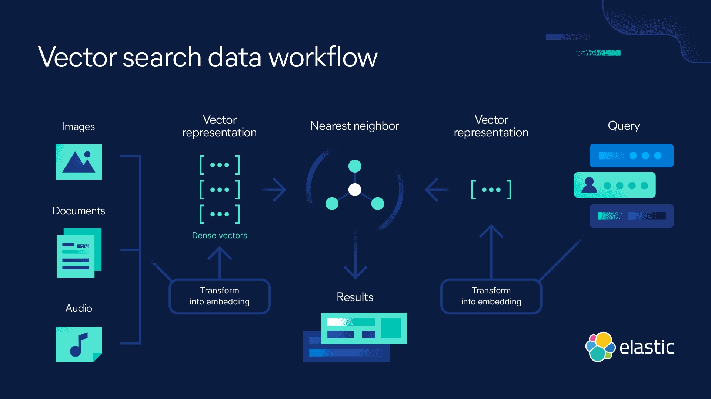

## Vector Search

### Introduction to Vector Search
Technique where data (like text or images) is converted into vectors (numerical representations) in a high-dimensional space. When search, the system compares the query’s vector to others in the database, finding the closest matches based on similarity. It's used for tasks like semantic search, recommendation systems, and image search, where the focus is on meaning or similarity rather than exact matches.

Why Use Vector Search?
- Handling Unstructured Data: Over 80% of data is unstructured (e.g., social media, images, videos). Vector search converts this data into vectors, enabling efficient similarity-based searches.
- Improving LLM Memory: LLMs lack long-term memory. Vector databases store data embeddings, allowing LLMs to retrieve and use past information, enhancing context and personalization.

### Vector Embedding 


- Used to transform words, sentences, and other data into numerical representations (vectors).
- Map different data types to points in a multidimensional space, with similar data points positioned near each other.
- These numerical representations assist machines understand and process this data more effectively.

### Types of Vector Embedding
1. Word Embedding
    - Techniques: Word2Vec, GloVe, FastText.
    - Purpose: Capture semantic relationships and contextual information.
2. Sentence Embedding
    - Models: Universal Sentence Encoder (USE), SkipThought.
    - Purpose: Represent overall meaning and context of sentences.
3. Document Embedding
    - Techniques: Doc2Vec, Paragraph Vectors.
    - Purpose: Capture semantic information and context of entire documents.
4. Image Embedding
    - Techniques: CNNs, ResNet, VGG.
    - Purpose: Capture visual features for tasks like classification and object detection.

### What Is Vector Database?
- A vector database indexes and stores vector embeddings, for fast search and optimized storage.
- Providing the ability to compare multiple things (semantically) at the same time.
- Helping machine learning models remember past data better, making them more useful for search,
recommendations, and text generation.

### Step by Step (Elasticsearch)
Kindly refer `elasticsearch.ipynb`.
1. Prepare and load `documents.json`.
2. Use the pretrained model `SentenceTransformer("all-mpnet-base-v2")` to generate embeddings.
3. Embedded all `text` fields in the dictionary `documents`.
4. Used `docker-compose.yaml` to run Elasticsearch. Make `docker` is running.  
```
    docker compose up
```
5. Setup ElasticSearch Connection.
6. Create Mappings and Index.

    Define index setting. Setting `1 shard` is ideal for small datasets and when simplicity and performance are prioritized. If dataset grows larger, can adjust and increase the shard count later for better distribution and scalability.
```
    index_settings = {
    "settings": {
        "number_of_shards": 1,
        "number_of_replicas": 0
    },
    "mappings": {
        "properties": {
            "text": {"type": "text"},
            "section": {"type": "text"},
            "question": {"type": "text"},
            "course": {"type": "keyword"} ,
            "text_vector": {"type": "dense_vector", "dims": 768, "index": True, "similarity": "cosine"},
        }
    }
```
7. Add documents data into Elasticsearch index.
8. Define query setting. 

`num_candidates` mainly depends on the size of the dataset, desired accuracy, and available computational resources. 768-dimensional vector is considered relatively moderate to high in terms of dimensionality for vector embeddings. Can start with 1000 - 5000 candidates and adjust based on results. For very large datasets (millions of vectors), may need 10,000 or more candidates. 

The suitable `k` value in vector search depends on the balance between accuracy and speed.
- Smaller k (e.g., 5 – 10): Faster, with fewer neighbors returned, ideal for quick, relevant results in smaller datasets.
- Larger k (e.g., 50 – 100): More accurate, especially for larger datasets or high-dimensional embeddings, but slower due to more neighbors being considered.

Start with a small k and increase it if more results or higher recall are needed.

```
    query = {
        "field": "text_vector",
        "query_vector": vector_search_term,
        "k": 5,
        "num_candidates": 10000,
    }
```
9. Select desired search (Keyword Search, Semantic Search, Hybrid Search)
```
response = es_client.search(
    index = index_name,
    query = {
        "match": {"section": "General course-related questions"},
    }, # keyword search
    knn = knn_query, # semantic search
    size = 5 # number of result will return
)
```
10. Getting the result
```
response["hits"]["hits"]
```